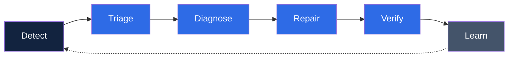

# CI/CD Repair Agent
 
A skill for designing and building closed-loop, self-healing CI/CD systems — pipelines that are continuously monitored, diagnosed, and repaired by AI agents, not just gated by static predefined checks.
 
## Overview
 
The system has two layers:
 
- **Deterministic layer** — lint, typecheck, tests, build, migrations. Cheap, reproducible, and boring on purpose. This is the sensor network.
- **Agentic layer** — AI agents (via `claude-code-action` or headless `claude -p`) that react to what the sensors report: triage failures, diagnose root causes, push candidate fixes as PRs, quarantine flaky tests, review incoming code, and run scheduled health patrols.
The deterministic layer decides whether something is wrong. The agentic layer decides what is wrong and what to do about it. The two are never blurred: agents never decide merge-worthiness on their own, and static checks never attempt judgment calls.
 
## The Loop
 

 
Every design decision maps to one of these six stages. If a stage is missing, the system is not closed-loop — it is alerts with extra steps.
 
## Core Principles
 
- Agents propose, CI disposes. Every fix lands as a PR and passes the same gates as human code.
- The whole system is read before any of it is designed — docs, ADRs, manifests, existing CI, test layout.
- Every failure is classified before an agent touches code, using a per-class repair policy: auto-fix, propose-PR, comment-only, or escalate.
- Loop prevention is mandatory: attempt counters, actor guards, concurrency groups, and a hard iteration ceiling.
- Agents run with least privilege. Untrusted content (fork PRs, issue text) is treated as a prompt-injection surface.
- Cost is a design axis: model tiering, turn ceilings, and a stated monthly budget per repo.
- The repair system itself is tested: seeded-failure drills, dry-run mode, and a verification checklist.
## Build Phases
 
1. System document analysis — build a system model from docs, manifests, existing CI, and test layout.
2. Risk register and edge-case analysis — project-side and repair-system failure modes.
3. Deterministic pipeline foundation — gates, caching, structured failure output for the agent layer.
4. Closed-loop architecture — the six-stage loop, failure taxonomy, escalation table.
5. Agent workflows — repair, review, interactive, sentinel, and triage workflows plus standing orders.
6. Security hardening — least privilege, injection-safe interpolation, supply-chain pinning.
7. Testing the repair system — seeded drills, dry-run mode, kill switch, verification checklist.
8. Runbook and evolution — operator runbook, decision table, what breaks at 10x scale.
## Safety Defaults
 
- Dry-run mode is on by default. Agents propose diagnoses and diffs without pushing until promoted to live.
- A kill switch disables the entire agent layer in one action.
- Agent configuration and workflow files are forbidden paths for auto-repair.
- The deterministic layer never depends on the agent layer. If the model API is down, CI still works.
## Anti-Patterns
 
- Agents that merge, force-push, or edit workflow/security files during auto-repair.
- Broad default token permissions, or secrets available to jobs that read fork-PR content.
- No actor guard or attempt ceiling.
- Routing every failure to the most capable model with no triage step.
- A self-healing system with no dry-run mode, no kill switch, and no ledger.
## Reference Material
 
- `references/closed-loop-design.md` — the six-stage loop in depth, failure taxonomy, escalation table, failure ledger format, confidence gating.
- `references/agent-workflows.md` — runnable workflow YAML for repair, review, interactive, sentinel, and triage agents; model tiering and cost controls.
- `references/security-hardening.md` — prompt injection classes in agentic CI, permission templates, injection-safe interpolation, incident response.
## Author
 
Nevil Choksi — AI Engineer, Builder, Systems Designer
